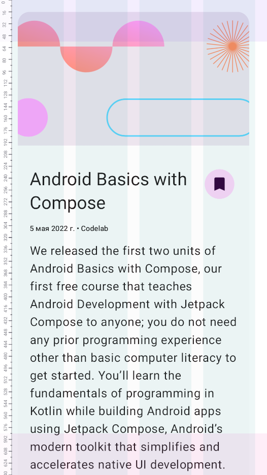
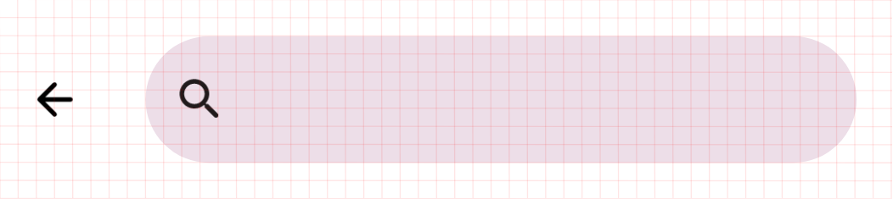
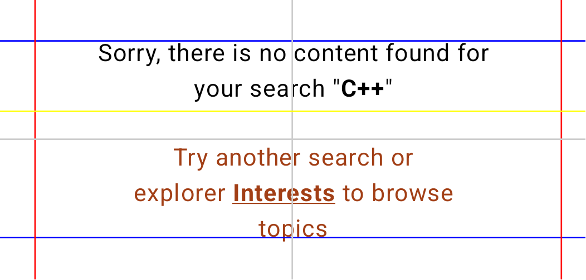
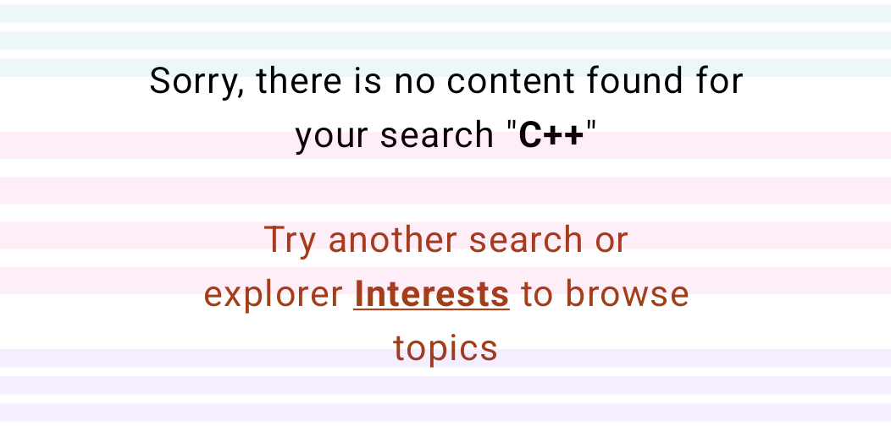
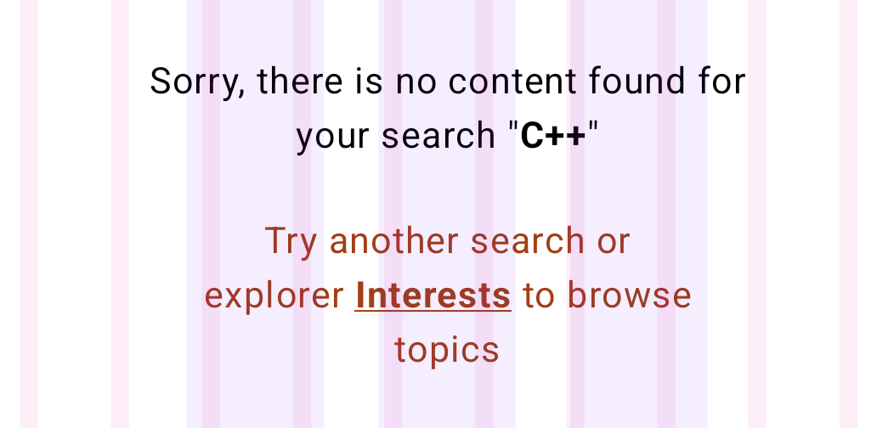
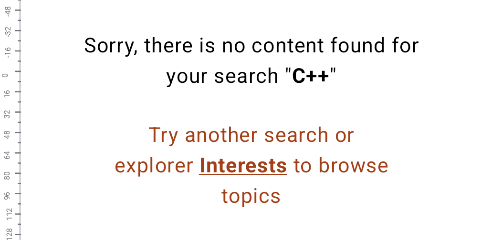
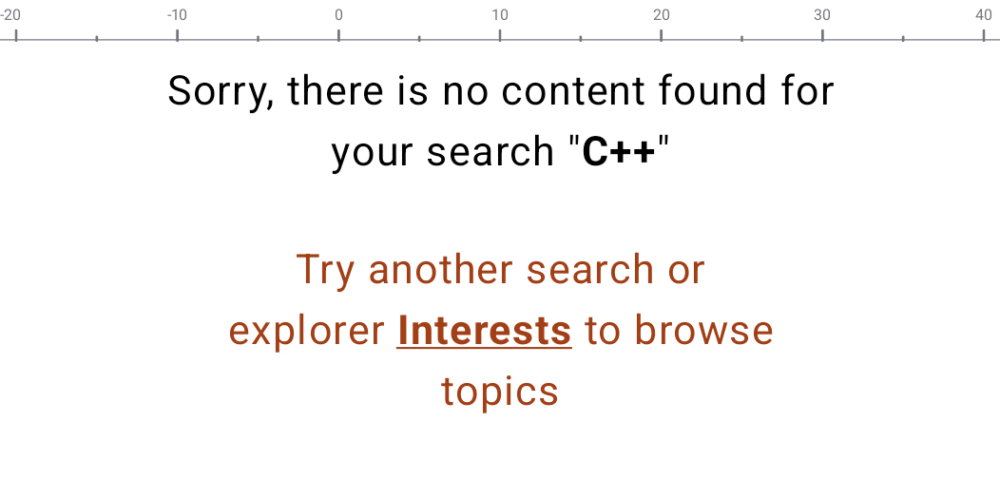

# Compose Debug Layout Toolbox

A set of tools for Compose to help you align objects: layouts, grids and rulers.

It is intended to be used only with `@Preview` composes, in screenshot tests or in debug drawers.

## Installation

Release and snapshot versions of the library are published to a temporary repository, since they are currently
used only in one pet project. File a bug report if you think this plugin could be useful on Maven Central.

Add the following to your project's settings.gradle:

```kotlin
pluginManagement {
    repositories {
        maven {
            url = uri("https://maven.pixnews.ru")
            mavenContent {
                includeGroup("ru.pixnews.debuglayout")
            }
        }
    }
}
```

Add required dependency:

```kotlin
dependencies {
    implementation("ru.pixnews.debuglayout:core:0.1-SNAPSHOT")
}
```

## Usage

Build `debuglayout {} ` modifier with the required tools. Example:

<picture >
  
</picture>

```kotlin
@Preview
@Composable
fun SimpleComposablePreview() {
    Box(
        modifier = Modifier
            .debugLayout {
                rowsFromTop(
                    rows = 1.asRowColumnCount,
                    height = 56.dp,
                    color = DebugLayoutDefaults.colorSecondary,
                )
                rowsFromBottom(
                    rows = 1.asRowColumnCount,
                    height = 56.dp,
                    color = DebugLayoutDefaults.colorTertiary,
                )
                columnsStretch(
                    columns = 4,
                    margin = 16.dp,
                    gutter = 16.dp,
                    color = DebugLayoutDefaults.colorPrimary,
                )
                verticalRuler()
            }
    ) {
        …
    }
}
```

## Tools

### Grid

`grid()` draws a simple grid of a specified size.

```kotlin
public fun grid(
    size: Dp,
    color: Color,
    strokeWidth: Dp,
)
```

Example:

```kotlin
@Preview
@Composable
private fun SearchToolbarPreview() {
    Box(
        modifier = Modifier
            .debugLayout {
                grid(size = 8.dp)
            },
    ) { … }
}
```



### Guidelines

Draws horizontal and vertical guidelines. Position of the guideline can be specified from top, bottom,
right, left, or center, with an optional offset in dp or percents.

```kotlin
fun guideline(
    position: DebugGuidelinePosition,
    color: Color,
    strokeWidth: Dp,
)
```

Example:

```kotlin
@Preview
@Composable
fun EmptySearchResultColumnPreview() {
    Box(
        modifier = Modifier
            .debugLayout {
                guideline(
                    position = Top(offset = 28.dp.asGuidelineOffset),
                    color = Color.Blue
                )
                guideline(
                    position = Bottom(28.dp.asGuidelineOffset),
                    color = Color.Blue
                )
                guideline(
                    position = Start(24.dp.asGuidelineOffset))
                guideline(
                    position = End(16.dp.asGuidelineOffset)
                )
                guideline(
                    position = CenterHorizontal(),
                    color = Color.LightGray
                )
                guideline(
                    position = CenterVertical(),
                    color = Color.LightGray
                )
                guideline(
                    position = Top(offset = (2/5f).asGuidelineOffsetPercent),
                    color = Color.Yellow
                )
            },
    ) {
        …
    }
}
```


There are also a number of auxiliary extensions:
```kotlin
DebugLayout.guidelineFromStart()
DebugLayout.guidelineFromEnd()
DebugLayout.guidelineFromTop()
DebugLayout.guidelineFromBottom()
DebugLayout.guidelineCenterHorizontal()
DebugLayout.guidelineCenterVertical()
```

### Rows and columns

Allows you to draw rows of a specified width and columns of a specified height with customized margins and gutters.

```kotlin
fun columns(
    // DebugColumnsArrangement: Top | Bottom | Center | Stretch
    arrangement: DebugColumnsArrangement,
    columns: RowsColumnsCount,
    color: Color,
)

fun rows(
    // DebugRowsArrangement: Left | Right | Center | Stretch
    arrangement: DebugRowsArrangement,
    rows: RowsColumnsCount,
    color: Color,
)

```

Example rows from top and bottom:
```kotlin
@Preview
@Composable
fun EmptySearchResultColumnPreview() {
    Box(
        modifier = Modifier
            .debugLayout {
                rows(
                    arrangement = DebugRowsArrangement.Top(
                        height = 8.dp,
                        offset = 2.dp,
                        gutter = 4.dp
                    ),
                    rows = 3.asRowColumnCount,
                    color = DebugLayoutDefaults.colorPrimary,
                )
                rows(
                    arrangement = DebugRowsArrangement.Bottom(
                        height = 8.dp,
                        offset = 2.dp,
                        gutter = 4.dp
                    ),
                    rows = 3.asRowColumnCount,
                    color = DebugLayoutDefaults.colorSecondary,
                )
                rows(
                    arrangement = DebugRowsArrangement.Center(
                        height = 12.dp,
                        gutter = 8.dp
                    ),
                    rows = 4.asRowColumnCount,
                    color = DebugLayoutDefaults.colorTertiary,
                )
            },
    ) {
        …
    }
}
```


Columns:

```kotlin
@Preview
@Composable
fun EmptySearchResultColumnPreview() {
    Box(
        modifier = Modifier
            .debugLayout {
                columns(
                    arrangement = Stretch(
                        gutter = 24.dp,
                        margin = 82.dp,
                    ),
                    columns = 3.asRowColumnCount,
                    color = DebugLayoutDefaults.colorSecondary,
                )
                columns(
                    arrangement = DebugColumnsArrangement.Right(
                        gutter = 32.dp,
                        width = 8.dp,
                        offset = 16.dp
                    ),
                    columns = Auto,
                    color = DebugLayoutDefaults.colorTertiary,
                )
            },
    ) {
        …
    }
}
```


Auxiliary extensions:
```kotlin
DebugLayout.columnsFromLeft()
DebugLayout.columnsFromRight()
DebugLayout.columnsFromCenter()
DebugLayout.columnsStretch()
DebugLayout.rowsFromTop()
DebugLayout.rowsFromBottom()
DebugLayout.rowsFromCenter()
DebugLayout.rowsStretch()
```

### Rulers

`horizontalRuler()` and `verticalRuler()` are designed to draw a horizontal or vertical ruler along the edge of 
the frame.

You can set the value of the ticks on the ruler: dp, pixels, millimeters or inches and the frequency.
You can also adjust the zero position: top, center or bottom with a defined offset.

```kotlin
fun horizontalRuler(
    step: DebugRulerMeasureUnit,
    zeroOffset: DebugRulerHorizontalZeroPoint,
)

fun verticalRuler(
    step: DebugRulerMeasureUnit = DebugLayoutDefaults.Ruler.step,
    zeroOffset: DebugRulerVerticalZeroPoint = DebugRulerVerticalZeroPoint.ZERO, 
)
```

Example of a vertical ruler with 16 dp ticks and a zero position at 16 dp from top:

```kotlin
@Preview
@Composable
fun EmptySearchResultColumnPreview() {
    Box(
        modifier = Modifier
            .debugLayout {
                verticalRuler(
                    step = 16.rulerDp,
                    zeroOffset = DebugRulerVerticalZeroPoint(
                        alignment = TOP,
                        offset = 56.rulerDp
                    ),
                )
            },
    ) { … }
}
```


Example of a horizontal ruler with a step of 10mm and a zero position at 10 mm to the left of center:

```kotlin
@Preview
@Composable
fun EmptySearchResultColumnPreview() {
    Box(
        modifier = Modifier
            .debugLayout {
                horizontalRuler(
                    step = 10.rulerMm,
                    zeroOffset = DebugRulerHorizontalZeroPoint(
                        alignment = CENTER,
                        offset = (-10).rulerMm
                    ),
                )
            },
    ) { … }
}
```


You can also check out this set of predefined layouts as example: [Material3DebugLayouts.kt](core%2Fsrc%2FcommonMain%2Fkotlin%2Fru%2Fpixnews%2Fdebuglayout%2FMaterial3DebugLayouts.kt)

